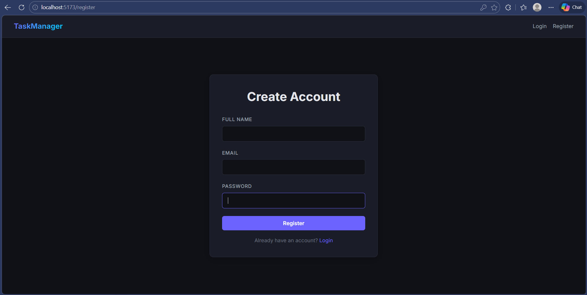
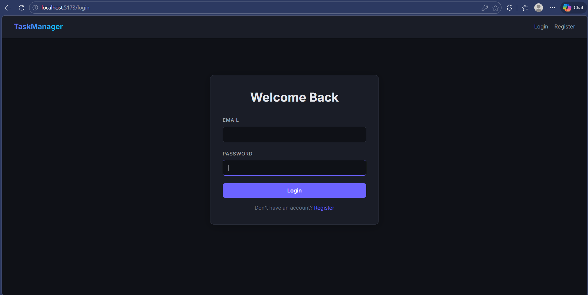
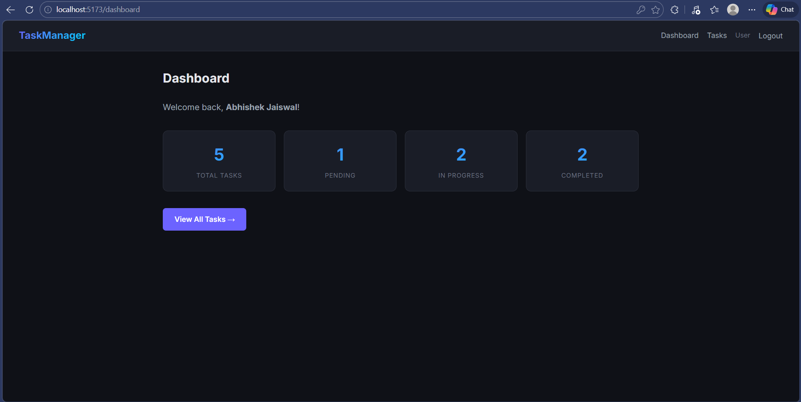
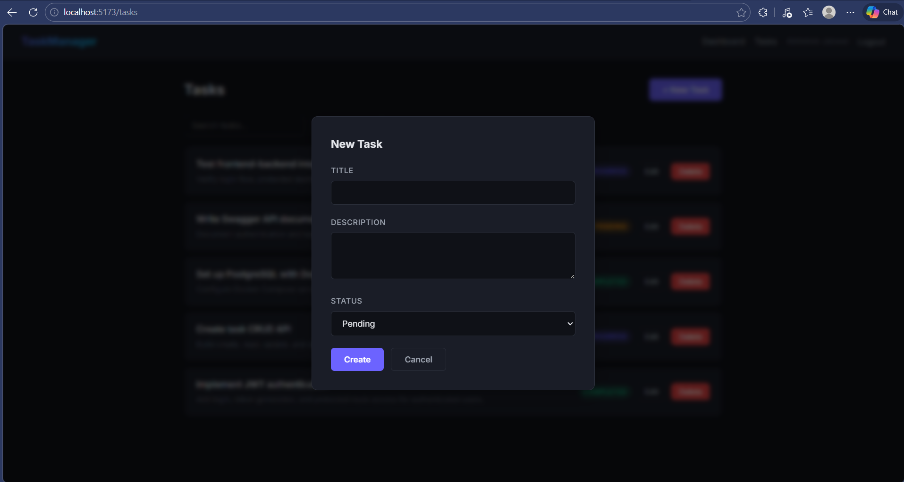
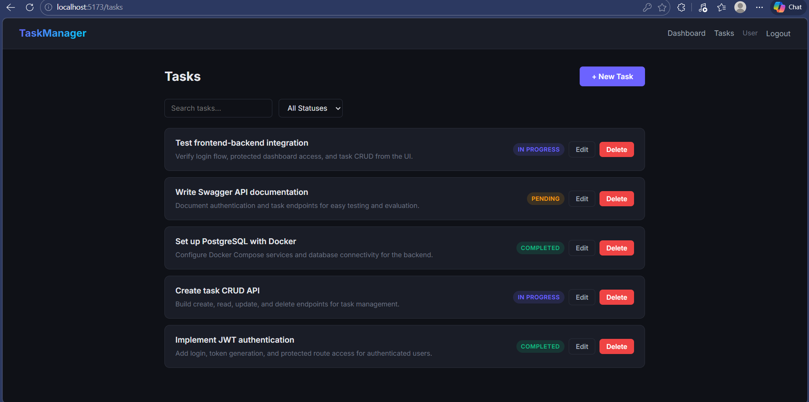
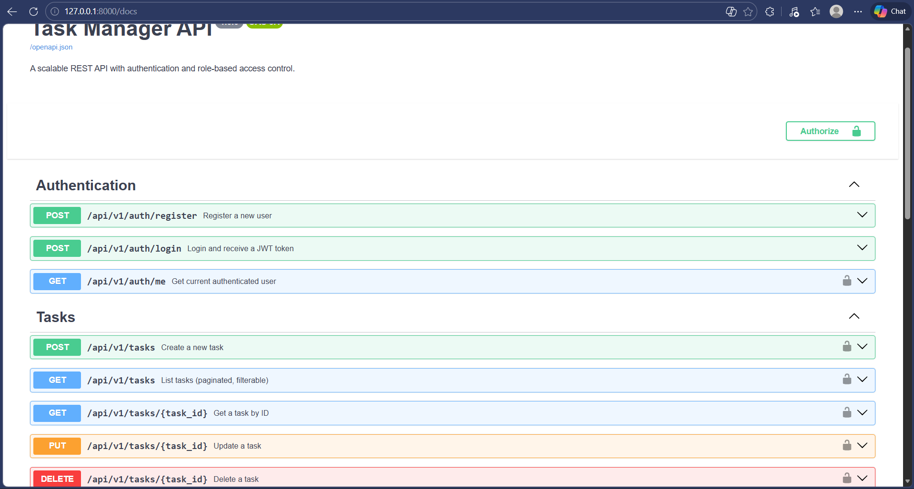
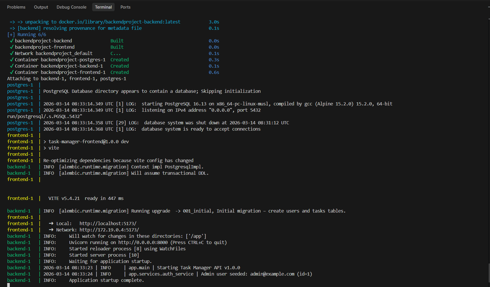

# 🚀 Secure Task Manager — Full-Stack Application

A production-quality REST API backend with JWT authentication, role-based access control (RBAC), and a React frontend — fully Dockerized with PostgreSQL and ready to deploy.

> Built as part of a **Backend Developer Internship** assignment. Backend is the primary focus; the frontend demonstrates real-world API integration.

---

## 📖 Overview

The **Secure Task Manager** is a full-stack web application that allows users to register, authenticate, and manage personal tasks through a secure REST API.

### Why This Project

- **Authentication & RBAC** are foundational to every production system — this project implements them from scratch using industry-standard patterns (JWT, bcrypt, role-based guards).
- **Clean Architecture** separates concerns into API → Service → Model layers, making the codebase easy to extend, test, and maintain.
- **Docker-First Deployment** means the evaluator can run the entire stack — PostgreSQL, FastAPI backend, React frontend — with a single command.

### How It Works

1. Users register and receive a hashed password entry in the database.
2. On login, the server issues a signed JWT token containing the user's ID and role.
3. Authenticated requests include the JWT in the `Authorization` header.
4. Endpoints enforce ownership rules (users manage their own tasks) and role restrictions (admins can access all resources).

---

## ✨ Features

### Backend Features

- ✅ User registration & login with JWT token issuance
- ✅ Password hashing using `bcrypt` (never stored in plaintext)
- ✅ Role-based access control (`user` and `admin` roles)
- ✅ Complete Task CRUD APIs with ownership enforcement
- ✅ Pagination, filtering by status, and search on task listings
- ✅ API versioning under `/api/v1/`
- ✅ Input validation with Pydantic schemas and field constraints
- ✅ Centralized error handling with consistent response format
- ✅ Structured request logging middleware with response timing
- ✅ Auto-generated Swagger documentation at `/docs`
- ✅ PostgreSQL database with Alembic migrations
- ✅ Admin user auto-seeding on startup via environment variables
- ✅ Dockerized backend with health checks

### Frontend Features

- ✅ User registration page with validation feedback
- ✅ User login page with JWT token handling
- ✅ Protected dashboard (redirects to login if unauthenticated)
- ✅ Full task management UI — create, edit, delete tasks via modals
- ✅ Search, status filtering, and pagination on task list
- ✅ Success and error message display on all operations
- ✅ Logout functionality (clears token and redirects)
- ✅ Dark-themed responsive UI

---

## 🛠 Tech Stack

| Layer        | Technology                                       |
|--------------|--------------------------------------------------|
| **Backend**  | Python 3.11, FastAPI, SQLAlchemy 2.0, Pydantic   |
| **Database** | PostgreSQL 16 (Docker), SQLite (local dev)       |
| **Auth**     | JWT (`python-jose`), bcrypt (direct hashing)     |
| **Migrations** | Alembic                                        |
| **Frontend** | React 18, Vite, Axios, React Router             |
| **Testing**  | Pytest, httpx (in-memory SQLite)                 |
| **DevOps**   | Docker, Docker Compose                           |

---

## 🏗 Project Architecture

The backend follows a **layered modular architecture** with clear separation of concerns:

```
┌──────────────────────────────────────────────┐
│                  API Layer                   │
│   Routes, request parsing, response format   │
│   (app/api/v1/endpoints/)                    │
├──────────────────────────────────────────────┤
│             Authentication Layer             │
│   JWT creation/verification, role guards     │
│   (app/api/deps.py, app/core/security.py)    │
├──────────────────────────────────────────────┤
│               Service Layer                  │
│   Business logic, data orchestration         │
│   (app/services/)                            │
├──────────────────────────────────────────────┤
│               Database Layer                 │
│   SQLAlchemy models, sessions, migrations    │
│   (app/models/, app/db/, alembic/)           │
└──────────────────────────────────────────────┘
```

**Why this structure is scalable:**
- Adding a new entity (e.g., Projects) requires only a new model, schema, service, and endpoint file — zero modifications to existing code.
- The service layer keeps business logic decoupled from HTTP handling.
- Dependency injection via FastAPI's `Depends()` makes auth guards reusable across any endpoint.

---

## 📁 Project Structure

```
root/
├── backend/
│   ├── app/
│   │   ├── api/
│   │   │   ├── v1/
│   │   │   │   ├── endpoints/
│   │   │   │   │   ├── auth.py              # Auth endpoints (register, login, me)
│   │   │   │   │   └── tasks.py             # Task CRUD endpoints
│   │   │   │   └── router.py                # v1 router aggregator
│   │   │   └── deps.py                      # Auth & RBAC dependencies
│   │   ├── core/
│   │   │   ├── config.py                    # Settings from environment
│   │   │   └── security.py                  # JWT & bcrypt utilities
│   │   ├── db/
│   │   │   ├── base.py                      # SQLAlchemy declarative base
│   │   │   └── session.py                   # Engine & session factory
│   │   ├── middleware/
│   │   │   └── logging_middleware.py         # Request logging middleware
│   │   ├── models/
│   │   │   ├── user.py                      # User model with roles
│   │   │   └── task.py                      # Task model with ownership
│   │   ├── schemas/
│   │   │   ├── user.py                      # User request/response schemas
│   │   │   └── task.py                      # Task request/response schemas
│   │   ├── services/
│   │   │   ├── auth_service.py              # Auth business logic
│   │   │   └── task_service.py              # Task business logic
│   │   ├── utils/
│   │   │   └── responses.py                 # Response format helpers
│   │   └── main.py                          # FastAPI app entry point
│   ├── alembic/
│   │   ├── versions/
│   │   │   └── 001_initial.py               # Initial migration
│   │   └── env.py                           # Alembic environment config
│   ├── tests/
│   │   ├── conftest.py                      # Test fixtures & DB setup
│   │   ├── test_auth.py                     # Auth endpoint tests
│   │   └── test_tasks.py                    # Task endpoint tests
│   ├── alembic.ini
│   ├── requirements.txt
│   ├── Dockerfile
│   └── .env.example
├── frontend/
│   ├── src/
│   │   ├── api/
│   │   │   └── client.js                    # Axios HTTP client
│   │   ├── components/
│   │   │   ├── Navbar.jsx                   # Navigation bar with logout
│   │   │   └── ProtectedRoute.jsx           # Auth route guard
│   │   ├── hooks/
│   │   │   └── useAuth.js                   # Authentication hook
│   │   ├── pages/
│   │   │   ├── Login.jsx                    # Login page
│   │   │   ├── Register.jsx                 # Registration page
│   │   │   ├── Dashboard.jsx                # Protected dashboard
│   │   │   └── Tasks.jsx                    # Task CRUD interface
│   │   ├── App.jsx                          # Root component with routing
│   │   ├── main.jsx                         # React entry point
│   │   └── index.css                        # Global styles
│   ├── index.html
│   ├── package.json
│   ├── vite.config.js
│   ├── Dockerfile
│   └── .env.example
├── docs/
│   └── screenshots/                         # Application screenshots
├── docker-compose.yml                       # Full-stack orchestration
├── .gitignore
└── README.md
```

---

## 📡 API Endpoints

### Authentication

| Method | Endpoint                 | Description              | Auth Required |
|--------|--------------------------|--------------------------|---------------|
| POST   | `/api/v1/auth/register`  | Register a new user      | No            |
| POST   | `/api/v1/auth/login`     | Login, receive JWT token | No            |
| GET    | `/api/v1/auth/me`        | Get current user profile | Yes (Bearer)  |

### Tasks

| Method | Endpoint                 | Description        | Auth Required       |
|--------|--------------------------|--------------------|---------------------|
| POST   | `/api/v1/tasks`          | Create a task      | Yes                 |
| GET    | `/api/v1/tasks`          | List tasks         | Yes                 |
| GET    | `/api/v1/tasks/{id}`     | Get a single task  | Yes (owner or admin)|
| PUT    | `/api/v1/tasks/{id}`     | Update a task      | Yes (owner or admin)|
| DELETE | `/api/v1/tasks/{id}`     | Delete a task      | Yes (owner or admin)|

**Query Parameters for `GET /api/v1/tasks`:**

| Parameter  | Type   | Description                                     |
|------------|--------|-------------------------------------------------|
| `page`     | int    | Page number (default: 1)                        |
| `per_page` | int    | Items per page (default: 20, max: 100)          |
| `status`   | string | Filter: `pending`, `in_progress`, `completed`   |
| `search`   | string | Search in task titles (case-insensitive)         |

**Role-Based Access:**
- **Regular users** can only view, edit, and delete their own tasks.
- **Admin users** can view, edit, and delete any user's tasks.

### Health Check

| Method | Endpoint   | Description           |
|--------|------------|-----------------------|
| GET    | `/health`  | Application health    |

---

## 📋 Swagger API Documentation

FastAPI auto-generates interactive API documentation. Once the application is running:

| Documentation | URL                           |
|---------------|-------------------------------|
| **Swagger UI**| http://localhost:8000/docs     |
| **ReDoc**     | http://localhost:8000/redoc    |
| **OpenAPI JSON** | http://localhost:8000/openapi.json |

You can **test all endpoints directly** from Swagger UI — click "Try it out", fill in parameters, and execute.

> **Postman Users:** Import the OpenAPI schema by navigating to `http://localhost:8000/openapi.json` and using Postman's **Import → Link** feature. All endpoints will be imported automatically.

---

## 📸 Screenshots

### Register Page
User registration form with name, email, and password fields. Validates input and displays success/error messages.



### Login Page
Login form with email and password. On success, redirects to the protected dashboard with a valid JWT.



### Dashboard Overview
Protected dashboard showing personalized welcome message and task statistics (total, completed, in-progress).



### Task Creation
Modal form for creating a new task with title, description, and status selection.



### Task List / CRUD
Full task management interface with search bar, status filter, edit/delete controls, and pagination.



### Swagger API Documentation
Interactive API documentation auto-generated by FastAPI, showing all authentication and task endpoints.



### Docker Running
Full stack running via Docker Compose — PostgreSQL, FastAPI backend, and React frontend all containerized.



---

## ⚡ Installation & Setup

### Prerequisites

- [Docker](https://docs.docker.com/get-docker/) & Docker Compose installed

### Docker Setup (Recommended)

```bash
# 1. Clone the repository
git clone <your-repo-url>
cd <project-directory>

# 2. Copy environment file
cp backend/.env.example backend/.env

# 3. Build and start all services
docker compose up --build
```

Docker Compose launches **three services**:

| Service      | URL                          | Description              |
|--------------|------------------------------|--------------------------|
| **Frontend** | http://localhost:5173         | React application        |
| **Backend**  | http://localhost:8000         | FastAPI REST API          |
| **Swagger**  | http://localhost:8000/docs    | Interactive API docs      |
| **PostgreSQL** | localhost:5432             | Database (internal)       |

> Migrations run automatically on container startup. The admin user is seeded automatically.

### Local Development (Without Docker)

**Backend:**

```bash
cd backend
python -m venv venv
venv\Scripts\activate          # Linux/Mac: source venv/bin/activate

pip install -r requirements.txt

# Copy and edit environment
cp .env.example .env
# Change DATABASE_URL to: sqlite:///./taskmanager.db

# Start server (tables auto-create for SQLite)
uvicorn app.main:app --reload --port 8000
```

**Frontend:**

```bash
cd frontend
npm install
npm run dev
```

---

## 🔐 Environment Variables

Copy `backend/.env.example` to `backend/.env` before running:

```bash
cp backend/.env.example backend/.env
```

| Variable                      | Description                              | Default                          |
|-------------------------------|------------------------------------------|----------------------------------|
| `DATABASE_URL`                | Database connection string               | PostgreSQL (Docker)              |
| `SECRET_KEY`                  | JWT signing secret                       | ⚠️ **Change in production!**    |
| `ALGORITHM`                   | JWT signing algorithm                    | `HS256`                          |
| `ACCESS_TOKEN_EXPIRE_MINUTES` | Token expiration (minutes)               | `60`                             |
| `CORS_ORIGINS`                | Allowed CORS origins (comma-separated)   | `http://localhost:5173`          |
| `ADMIN_EMAIL`                 | Seed admin email                         | `admin@example.com`              |
| `ADMIN_PASSWORD`              | Seed admin password                      | `admin123`                       |
| `ADMIN_NAME`                  | Seed admin display name                  | `Admin`                          |

> ⚠️ **Never commit `backend/.env` to Git.** Only `.env.example` is tracked. The `.gitignore` enforces this.

---

## 👤 Default Admin Credentials

An admin user is **automatically created** on application startup using environment variables:

| Field    | Value                |
|----------|----------------------|
| Email    | `admin@example.com`  |
| Password | `admin123`           |
| Role     | `admin`              |

Use these credentials to log in with admin privileges and manage all users' tasks.

---

## 🧪 Testing

```bash
cd backend
pip install -r requirements.txt
pytest tests/ -v
```

**Test Coverage (10 tests):**

| Test                                | What It Verifies                           |
|-------------------------------------|--------------------------------------------|
| `test_register_success`             | User registration with valid data          |
| `test_register_duplicate_email`     | Duplicate email rejection (409)            |
| `test_login_success`                | Login with correct credentials             |
| `test_login_wrong_password`         | Login rejection with wrong password (401)  |
| `test_get_me_protected`             | Accessing `/me` with valid token           |
| `test_get_me_unauthorized`          | Accessing `/me` without token (401)        |
| `test_create_task`                  | Task creation with authentication          |
| `test_list_tasks`                   | Task listing with ownership filtering      |
| `test_update_task`                  | Task update with ownership verification    |
| `test_delete_task`                  | Task deletion with ownership verification  |

> Tests run against an **in-memory SQLite database** — no PostgreSQL required.

---

## 🔒 Security Considerations

| Practice                    | Implementation                                                  |
|-----------------------------|-----------------------------------------------------------------|
| **Password Hashing**        | bcrypt (direct) — passwords are never stored in plaintext       |
| **JWT Authentication**      | Stateless tokens with HS256 signing and configurable expiration |
| **Role-Based Access**       | Reusable FastAPI dependencies enforce `user` vs `admin` roles   |
| **Input Validation**        | Pydantic schemas enforce types, lengths, email format           |
| **SQL Injection Prevention**| SQLAlchemy ORM with parameterized queries throughout            |
| **CORS Protection**         | Configured to allow only specified origins                      |
| **Environment Secrets**     | All sensitive config loaded from `.env` — never hardcoded       |
| **Ownership Enforcement**   | Users can only access their own resources; admins bypass this   |

> **Note on Token Storage:** JWT tokens are stored in `localStorage` for demo simplicity. In a production application, **HttpOnly secure cookies** would be preferred to mitigate XSS attack vectors.

---

## 📈 Scalability Considerations

| Aspect                     | How It's Addressed                                                         |
|----------------------------|----------------------------------------------------------------------------|
| **Modular Architecture**    | Clean separation (routes → services → models) — easy to extend            |
| **Stateless JWT**          | No server-side sessions — any instance can validate tokens                 |
| **Microservice-Ready**     | Auth and task modules can be extracted into separate services               |
| **Redis Caching**          | Can be added for rate limiting, session management, response caching       |
| **Load Balancing**         | Stateless design supports Nginx, HAProxy, or cloud load balancers          |
| **Container Deployment**   | Dockerized and ready for Kubernetes, AWS ECS, or any orchestration tool    |
| **Background Workers**     | Celery + Redis can handle async jobs (emails, reports, notifications)      |
| **Database Scaling**       | Connection pooling configured; supports read replicas and sharding         |

---

## 🔮 Future Improvements

- [ ] Refresh token rotation for enhanced security
- [ ] Email verification on registration
- [ ] Password reset flow
- [ ] Rate limiting middleware
- [ ] Redis caching layer
- [ ] WebSocket real-time notifications
- [ ] File upload support for tasks
- [ ] Comprehensive integration & end-to-end tests
- [ ] CI/CD pipeline (GitHub Actions)
- [ ] Production Nginx reverse proxy configuration
- [ ] Audit logging for admin actions

---

## 📝 Evaluation Notes

This project was built to satisfy the **Backend Developer Internship** assignment requirements:

| Requirement                  | Status  |
|------------------------------|---------|
| REST API design              | ✅ Done |
| JWT authentication           | ✅ Done |
| Role-based access control    | ✅ Done |
| CRUD APIs (Tasks)            | ✅ Done |
| Input validation             | ✅ Done |
| Error handling               | ✅ Done |
| Database modeling            | ✅ Done |
| API documentation (Swagger)  | ✅ Done |
| Frontend integration         | ✅ Done |
| Docker deployment            | ✅ Done |
| Automated tests              | ✅ Done |
| Structured logging           | ✅ Done |

---

## 📄 License

This project was built as part of a Backend Developer Internship assignment.
